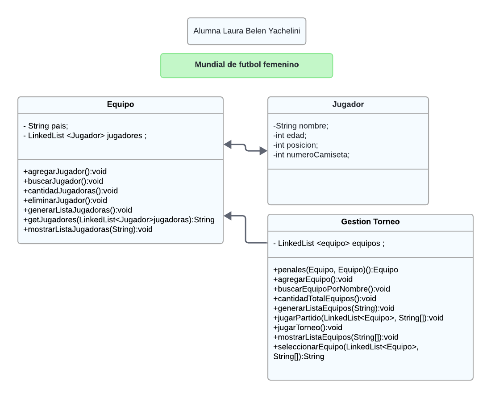

# Gestor de Torneos - Mundial Femenino de Fútbol

## Descripción

Este programa es un gestor de torneos diseñado específicamente para el Mundial Femenino de Fútbol. Permite la administración y seguimiento de los equipos, partidos, resultados y fases del torneo.

## Características

- **Gestión de Equipos:** Añadir, editar y eliminar equipos participantes.
- **Gestión de Jugadores:** Añadir, editar y eliminar jugadores participantes.
- **Generacion de fases del torneo:** Generar automaticamente los partidos entre los equipos.
- **Apuesta:** El usuario puede ingresar un pronostico del equipo que estima ganador, antes de comenzar el torneo.

## Diagrama

